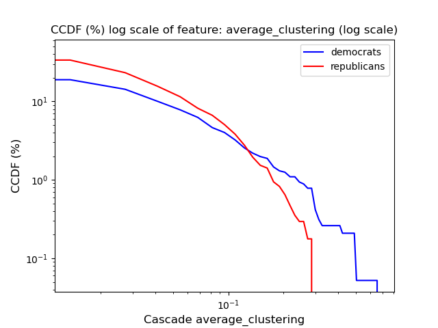
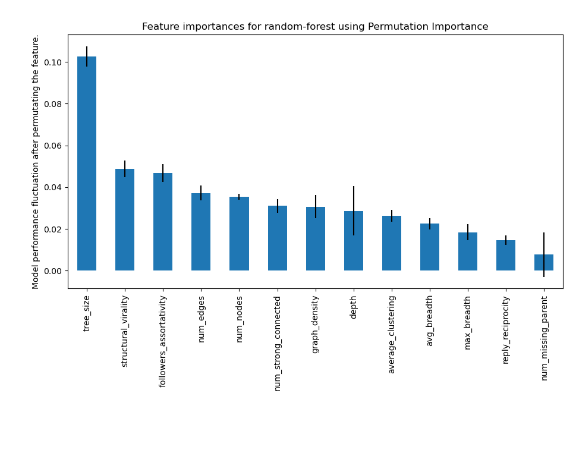

# Which party is this? Predicting the political leaning in a twitter conversation.

## Data

### Ground truth

We use the [congress-legislators](https://github.com/unitedstates/congress-legislators) Github repository to label the Twitter accounts and biographical information of the current members of Congress. The legislators’ bio information (including their political party) can be found in the file called `legislators-current`, and their official social media accounts can be found in `legislators-social-media`. 

### Tweets conversations

We use the [tweepy API](https://docs.tweepy.org/en/stable/client.html#tweepy.Client.get_users_tweets) to download the tweets posted by the accounts identified in Step 1. Ignore tweets that are replies (i.e., not root tweets) and retweets. Use the `expansions` and `tweet.fields` query parameters to request additional information that help construct the reply trees and reply graphs in the following steps. Then use `conversation_id` as a filter operator  to search for tweets posted as part of the conversations prompted by the previous tweets.

## Analysis

### Feature selection + visualization

We group the tweets by conversation ID and construct the reply tree and reply graphs for each conversation. We use [`treelib`](https://treelib.readthedocs.io/en/latest/) and [`networkx`](https://networkx.org/documentation/stable/install.html) to visualize some reply trees and reply graphs. Then we compute various characteristics of the reply trees (e.g., size, depth, breadth) and the reply graphs (e.g., size, density, number of connected components, reciprocity). 

### Modeling

Using the conversation characteristics computed in the previous step, we train a model that classifies the conversations by whether they were started by a Democrat or a Republican with the [`scikit-learn` package](https://scikit-learn.org/stable/) to train and evaluate the models. We run k-fold cross-validation and analyze the features we selected using [permutation feature importance](https://scikit-learn.org/stable/modules/permutation_importance.html).

## Results

### Feature analysis

#### CCDF

More can be found at [CCDF plots](ccdf/)

#### Permutation-based

### Prediction results

We use accuracy for performance measurements as class imbalance is not an issue here.

| Model         | Train    | Test     |
| ------------- | -------- | -------- |
| Random Forest | **0.78** | **0.69** |
| SVM           | 0.67     | 0.66     |
| Naive-Bayes   | 0.59     | 0.59     |
| KNN           | 0.70     | 0.65     |

